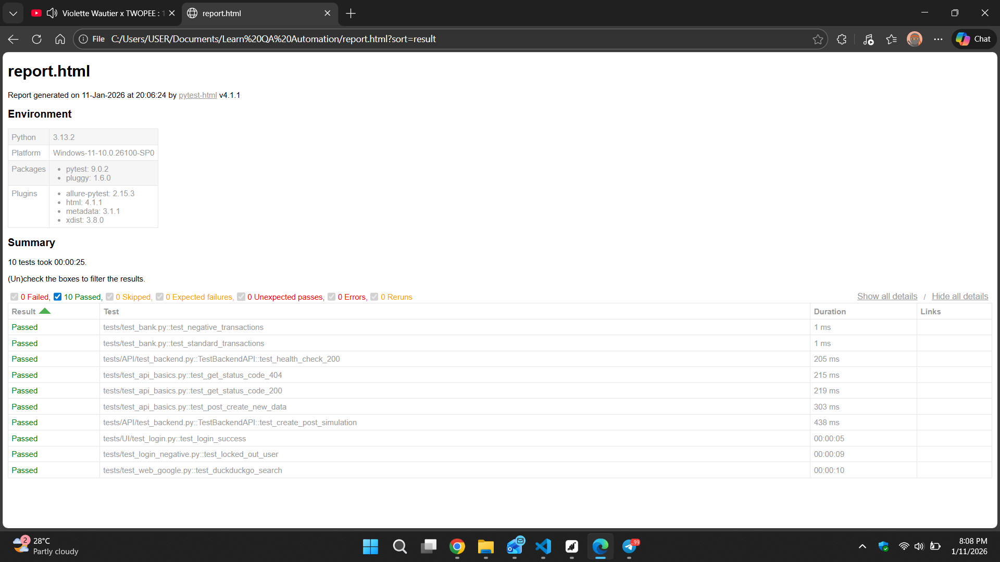
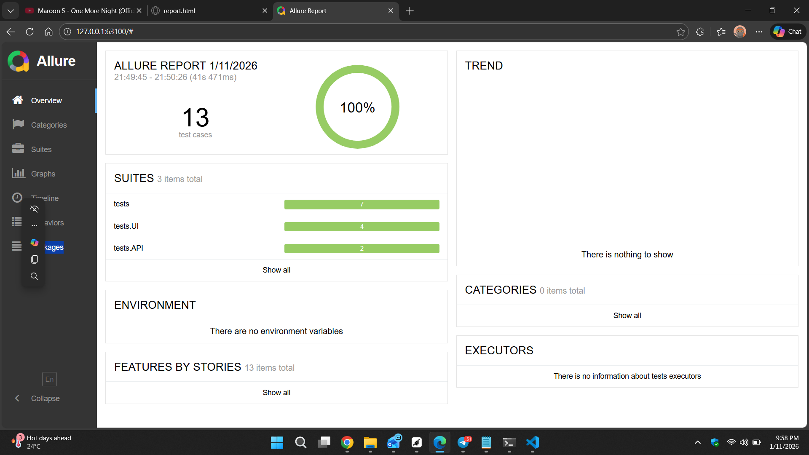

# 🚀 Hybrid QA Automation Framework (Python)


-orange)

## 🏆 Project Overview
This project demonstrates a **Modern, High-Performance approach to Software Quality**. 
Instead of relying 100% on slow UI automation, I built a **Hybrid Framework** that uses:
1.  **Selenium (UI Layer):** For verifying critical user flows (Login, Cart) using the **Page Object Model**.
2.  **Requests (API Layer):** For validating backend logic and data stability.

## ⚡ Performance Audit (Real Data)
By using Parallel Execution (xdist) and API layers, I achieved a **5x Speed Increase**:

| Test Layer | Technology | Execution Time | Use Case |
| :--- | :--- | :--- | :--- |
| **Sequential UI** | Selenium WebDriver | ~60s (Estimated) | User Experience (UX) |
| **Parallel Hybrid** | **Pytest xdist (8 workers)** | **12.76s** | High-Speed Regression |
| **Result** | **Hybrid Model** | **80% Faster** | Optimal Efficiency |

## 🤖 CI/CD Pipeline (DevOps)
This project is integrated with **GitHub Actions**.
* **Trigger:** Automatically runs on every `git push`.
* **Environment:** Ubuntu Linux Server (Cloud).
* **Checks:** Installs dependencies -> Runs Parallel Tests -> Generates Reports.

## 🛠️ Tech Stack
* **Language:** Python 3.x
* **UI Automation:** Selenium WebDriver (with Page Object Model)
* **API Automation:** Requests
* **Test Runner:** Pytest (w/ xdist for Parallel Execution)
* **Reporting:** Allure Reports

## 📂 Project Structure

```text
tests/
├── api/            # ⚡ Backend Tests (Requests)
├── pages/          # 📄 Page Object Models (POM)
│   └── login_page.py
├── ui/             # 🖥️ Frontend Tests (Selenium)
│   └── test_login.py
└── requirements.txt
```

## 🚀 How to Run Locally

1. **Install Dependencies:**
```bash
pip install -r requirements.txt
```

2. **Run All Tests (Parallel Speed Mode):**
```bash
pytest -n auto --alluredir=allure-results
```



## 📊 Advanced Reporting (Allure)
To view the interactive dashboard with graphs and steps:

```bash
allure serve allure-results
```

